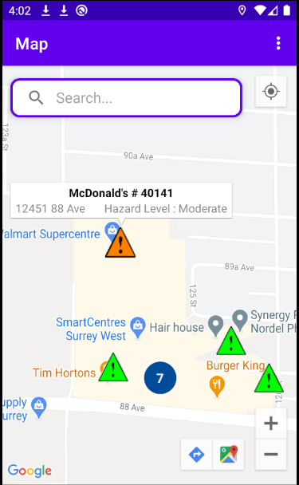
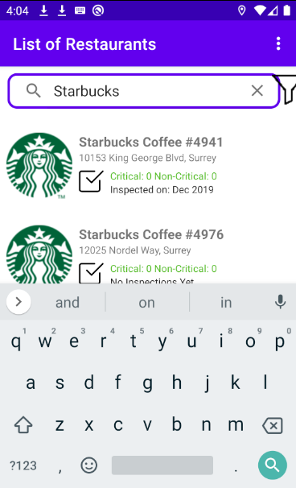
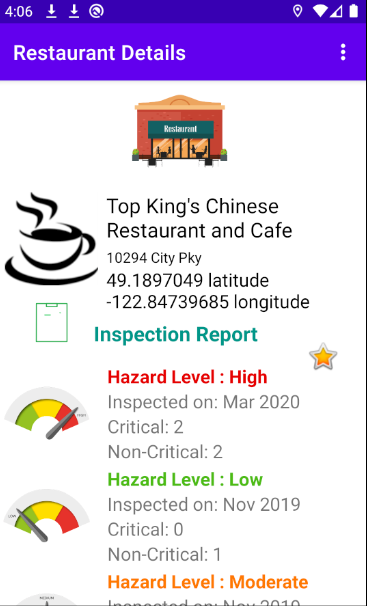
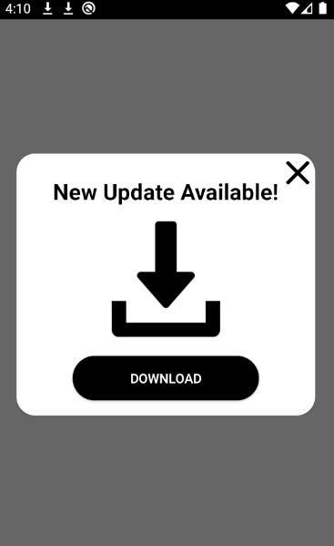

# Restaurant Inspection app
The project is an Android mobile app developed by a team of four students using Android Studio and Java. The app aims to provide users with up-to-date information on Vancouver restaurants' inspections reports, allowing them to search for specific restaurants and apply filters to find relevant information.

The primary goal of the app is to empower users with accurate and timely information about the inspections conducted at various restaurants in Vancouver. By leveraging the Vancouver restaurants' inspections API server, the app fetches the latest inspection reports and presents them in an intuitive and user-friendly manner.

  
  
  
  
  

## Role and responsibilities
In an Agile Scrum environment, I had the opportunity to serve as the Product Owner, taking on a pivotal role in the development process. Throughout the project, I actively collaborated with the team to define project goals, establish clear scope boundaries, and elicit comprehensive requirements. 

In addition to my role, took responsibility for developing and implementing the following features:

- **Update and Download**: Implemented a feature that utilizes the Vancouver restaurants' inspections API server to fetch the latest inspections reports, ensuring that users have access to the most up-to-date information on restaurant inspections.

- **Search and Filter**: Created a search functionality that enables users to find specific restaurants based on their preferences. Additionally, implemented filtering options to allow users to refine their search results based on various criteria.

## Technologies:
- **Java**: The main programming language used
- **Android Studio**: The primary integrated development environment (IDE) used for developing the Android mobile app.
- **Google Maps API**: The app integrated the Google Maps API to provide location-based services and enhance the user experience.
- **Vancouver Restaurants' Inspections API**: The app utilized the Vancouver Restaurants' Inspections API to retrieve the latest inspections reports.
- **Unit Testing**: The development process included unit testing to ensure the reliability and quality of the app.
